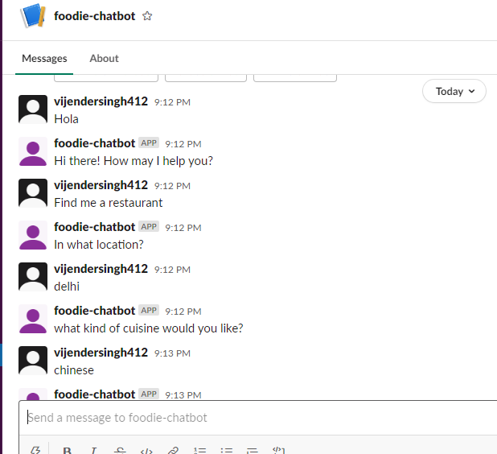
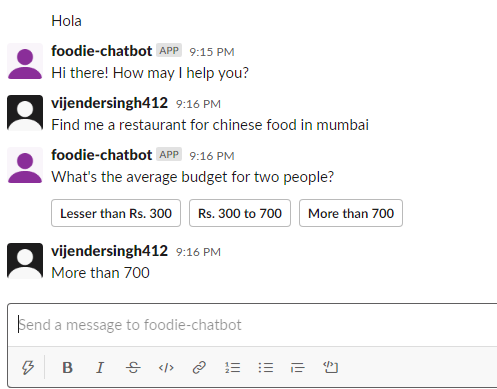
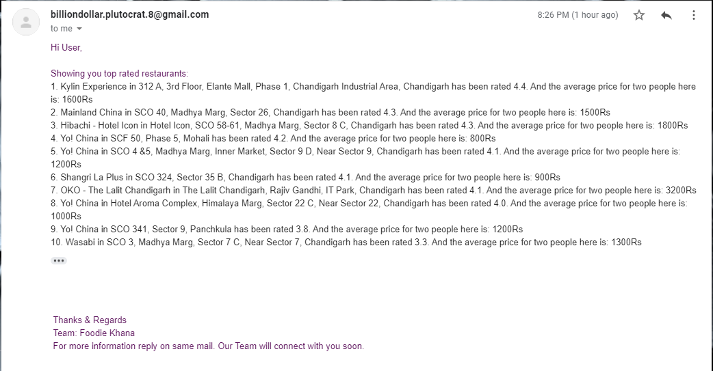

# Foddie_Khana_rasa_2.0


This repo contains a chatbot for Food ordering and using Zomato Api for searching best restaurant.
An Indian startup named 'Foodie Khana' wants to build a conversational bot (chatbot) which can help users discover restaurants across several Indian cities.

Goal:
The main purpose of the bot is to help users discover restaurants quickly and efficiently and to provide a good restaurant discovery experience.

Currently the compant is having its business in Tier-1 and Tier-2 cities. 
Tier-1:
Tier-2:
It will reply back with something like "We do not operate in that area yet" if your city is not amoung Tier-1 and Tier-2.

The bot is able to identify common synonyms of city names, such as Bangalore/Bengaluru, Mumbai/Bombay, Allahabad/Prayagraj etc.
The cuisine preference is taken from the customer.



The bot will then ask for Average budget for two people.


 
And then it returns the results to the user, displaying the top 5 restaurants in a sorted order (descending) of the average Zomato user rating (on a scale of 1-5, 5 being the highest). 
>The format is as: {restaurant_name} in {restaurant_address} has been rated {rating}.

Finally, the bot will ask the user whether he/she wants the details of the top 10 restaurants on email. If the user replies 'yes', the bot should ask for user’s email id and then send it over email. Else, just reply with a 'goodbye' message. 

>The mail will have the following details for each restaurant:
>Restaurant Name
>Restaurant locality address
>Average budget for two people
>Zomato user rating 



Lets Go: YEEEEEEEEEEEEEEE
Its recommended to create a virtual enviornment before start working.
Use Requirements.txt to install dependencies for the project.
Actions Require a Zomato API creditials. Grab it from [here](https://developers.zomato.com/api)

```Python: 3.8.3
Tensorflow: 2.3.1
Rasa Version     : 2.0.2
Rasa SDK Version : 2.0.0
Rasa X Version   : None (Doesnt allow in python 3.8 till date 27/10/2020 but if you want you can go with lower version of python and install rasa x) 
Python Version   : 3.8.3
Operating System : Windows-10-10.0.18362-SP0
Python Path      : c:\programdata\miniconda3\python.exe
```
Slack Integration:  Follow this [link](https://medium.com/analytics-vidhya/integrating-your-rasa-chat-bot-with-slack-c18bffc6018b)

Thanks for reading. Let me know in case of issue.. 
